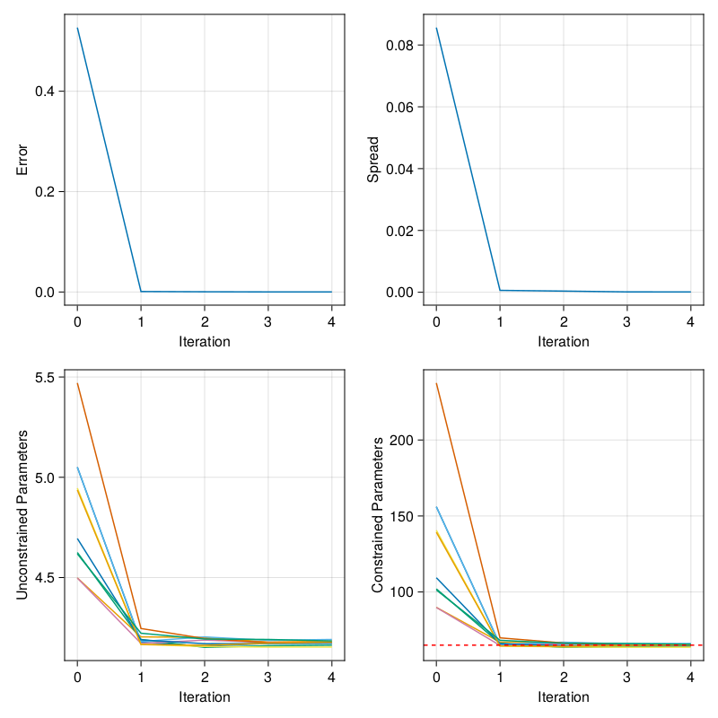

# Experiment Set Up Guide for ClimaAtmos

Please read this entire guide before setting up an experiment.
This guide assumes familiarity with ClimaAtmos and a basic understanding of Ensemble Kalman Inversion (EKI). Because moderate resolution ClimaAtmos runs need to be run with MPI and/or on GPU, this example demonstrates how to run the pipeline of a perfect model example calibration (i.e., generating the "true" data with the same model that we are calibrating with towards a known set of parameters) using bash scripts for the Caltech HPC cluster and the EKI calibration machinery.

## Summary

The overall pipeline is as follows:

For a perfect model scenario, observations are generated by running the model and then processing the diagnostic output through the constructed observation map.

For the example experiment, `sphere_held_suarez_rhoe_equilmoist`, this is done by running
`sbatch experiments/sphere_held_suarez_rhoe_equilmoist/generate_observations.sbatch`. This script runs the model, passes the output through the observation map, and saves the result.

Once the observations have been processed and saved, the actual calibration pipeline can be run via
`bash experiments/pipeline.sh sphere_held_suarez_rhoe_equilmoist 8`.

!!! note
    The command line interface for `pipeline.sh` will change. For now, the first entry is the experiment id and the second is the number of tasks to use per ensemble member.

This consists of three `sbatch` scripts:
- `initialize.sbatch` initializes the Julia project and the ensemble
- `model_run.sbatch` runs an individual forward model
- `update.sbatch` performs the update step and sets up the next iteration

To calibrate parameters, you need:
- Atmos model configuration
- Steady-state restart file
- EKP configuration
- Prior parameter distributions
- Truth and noise data
- Observation map script with a function `observation_map(iteration)`

These components are detailed in the guide below. Examples of all of these can also be found in `experiments/sphere_held_suarez_rhoe_equilmoist`

First, create a folder for your experiment with a descriptive experiment id in the `experiments/` folder. All of the components described below will be stored in this folder.

## Atmos Configuration File
This is the ClimaAtmos configuration which will be used to run all simulations in the calibration. The only changes between model runs are the parameters selected for calibration.
This file is a typical Atmos YAML file with a few restrictions. It must:

- be named `model_config.yml`.
- include an `output_dir` to store model output.
- include the path to the restart file. This is detailed in the next section.
Here is an example of the arguments you will need:
```
output_dir: output/experiment_name
restart_file: experiments/experiment_name/restart_file.hdf5
```

If your configuration requires a parameter TOML file, add this file to the experiment folder and set the `toml` entry in the configuration to the relative file path from the base directory of `CalibrateAtmos.jl`.

!!! note
    When targeting a global or otherwise costly simulation, it may be worth it to optimize your timestep `dt` as well as your timestepping algorithm, `ode_algo`.

## Restart File
The restart file is a model snapshot which will be used to spin-off all ensemble members' forward model runs.

Once you have settled on a configuration, follow these steps to generate a restart file:

1. Run ClimaAtmos with your configuration to determine the time it takes for the simulation to reach an equilibrium state.
2. Generate a restart file by setting `dt_save_restart` in the model configuration to the equilibrium timestamp.
3. Transfer the file to your experiment directory and enter the relative path into your atmosphere configuration file:
```
restart_file: experiments/experiment_name/restart_file.hdf5
```

!!! note
    A restarted simulation starts from the saved date of the restart file. A restart file saved at 200 days and a `t_end` of 201 days will only run for 1 simulated day:
    ```
    restart_file: experiments/experiment_name/day200.hdf5
    t_end: 201 days
    ```

## Prior Distribution File
First, create your TOML file in your experiment folder.
For each calibrated parameter, create a prior distribution with the following format:
```toml
[long_name]
alias = "alias_name"
type = "float"
prior = "Parameterized(Normal(0,1))"
constraint = "[bounded(0,5)]"
```
Note that the prior distribution here is in unconstrained space - the `constraint` list constrains the distribution in parameter space.

!!! note "Why two parameter spaces?"
    The calibration tools are effective when working with unconstrained parameters (`u`), whereas physical models typically require (partially-)bounded parameters (`φ`).
    To satisfy both conditions the `ParameterDistribution` object contains maps between these two spaces. The drawback is that the prior must be defined in the unconstrained space.

An easy way to generate prior distributions in constrained parameter space is with the [constrained_gaussian](https://clima.github.io/EnsembleKalmanProcesses.jl/dev/API/ParameterDistributions/#EnsembleKalmanProcesses.ParameterDistributions.constrained_gaussian) constructor from `EnsembleKalmanProcesses.ParameterDistributions`. Here is an example:
```julia
using EnsembleKalmanProcesses.ParameterDistributions
physical_mean = 125
physical_std = 40
lower_bound = -50
upper_bound = Inf
constrained_gaussian("name", physical_mean, physical_std, lower_bound, upper_bound)
```
This constructor will provide a Normal distribution, which, when transformed will approximate the target mean and standard deviation provided.
```
ParameterDistribution with 1 entries:
'name' with Constraint{BoundedBelow}[Bounds: (-50, ∞)] over distribution
Parameterized(Distributions.Normal{Float64}(μ=5.1393230339433345, σ=0.2256676316186263))
```
Copy the mean and standard deviation values into the constructor for the prior distribution in your TOML file like so:
```toml
[long_name]
alias = "alias_name"
type = "float"
prior = "Parameterized(Normal(5.1393230, 0.225667))"
constraint = "bounded_below(-50)"
description = " this prior has approximate (mean,std) = (125,40) and is bounded below by -50"
```

You can also ensure that the bounds match the `constraint` entry in your TOML file.
Since `constraint` is a TOML string parsed to a vector in Julia, ensure that you have quotes around the square brackets for the constraint list.

Constraint constructors:
- Lower bound: `bounded_below(0)`
- Upper bound: `bounded_above(2)`
- Upper and lower bounds: `bounded(0, 2)`

!!! note
    The API for constrained_gaussian priors in TOML files is coming soon. This page will be updated accordingly.

## Observation Map
The observation map is applied to process model output diagnostics into the exact observable used to fit to observations. In a perfect model setting it is used also to generate the observation.

This component is inflexible for now. Your observation map file must be a script with the name `observation_map.jl` which exports a function `observation_map(::Val{:<experiment_id>}, iteration)`, this function is specific to each experiment, so it is dispatched on the `experiment_id`.
These requirements arise from the update step, which runs:
```julia
include("experiments/$experiment_id/observation_map.jl")
observation_map(::Val(Symbol(experiment_id)), iteration)
```
This function must load in model diagnostics for each ensemble member in the iteration and construct an array `arr = Array{Float64}(undef, dims..., ensemble_size)` such that
`arr[:, i]` will return the i-th ensemble member's observation map output. Note this floating point precision is required for the EKI update step.

In the update step of EKI, the array will be saved in a JLD2 file named `observation_map.jld2` in the iteration folder of the output directory.

As an example, in `observation_map(iteration)` in the `sphere_held_suarez_rhoe_equilmoist` experiment, we have the following sequence:

`observation_map(::Val{:sphere_held_suarez_rhoe_equilmoist}, iteration)` constructs the array to store the ensemble's observations. Then, for each ensemble member `m`:
- it loads in the model diagnostic output, in this case 60-day air temperature averages.
- it calls `process_member_data(m)` and stores the result in the output array.
Pseudocode for `observation_map(iteration)`:
```julia
function observation_map(::Val{:sphere_held_suarez_rhoe_equilmoist}, iteration)
    # Get Configuration
    experiment_id = "sphere_held_suarez_rhoe_equilmoist"
    config = load_config(experiment_id)
    ensemble_size = config["ensemble_size"]

    # Setup output array
    # dims = size of individual member observation map output
    dims = 1
    G_ensemble = Array{Float64}(undef, dims..., ensemble_size)

    for m in 1:ensemble_size
        ta = load_member_diagnostics(m)
        # Compute observation map for the member
        G_ensemble[:, m] = process_member_data(ta)
    end
    return G_ensemble
end
```

`process_member_data(m)` then does the following:
1. Removes the first two samples to ensure an equilibrium state
2. Averages across latitude and longitude
3. Extracts the second height slice
4. Returns the third sample in an array

Pseudocode for `process_member_data(m)`:
```julia
function process_member_data(ta; output_variance = false)
    # Cut off first two points to ensure equilibrium, grab second height slice
    ta_second_height = ta[3:size(ta)[1], :, :, 2]
    # Average over long and latitude
    area_avg_ta_second_height =
        longitudinal_avg(latitudinal_avg(ta_second_height))
    # Take the third sample
    observation = [area_avg_ta_second_height[3]]
    return observation
end
```

If you are running a perfect-model experiment and generating truth data from ClimaAtmos itself, you may find it useful to create a kernel function to compute the observation map for each ensemble member. You can use this to run the default simulation's diagnostic output through the observation map and save the truth data and noise.

## Generating Truth Data
The truth data must be an array of observations with the same dimensions as an individual ensemble member's entry in the observation map (`arr[:, i]` from above).

The noise is the sample covariance of the truth data. The dimension of each truth data sample determines how many samples you need to generate. Covariance estimation techniques may be required for high dimensional truth data.

Save a single sample from the observations and the noise in separate JLD2 files. These will be read in when constructing the EKP object.
For `sphere_held_suarez_rhoe_equilmoist`, these are saved as `obs_mean.jld2` and `obs_noise_cov.jld2` respectively.
To inspect them, start `julia --project=experiments` and run:
```julia
import JLD2
experiment_path = joinpath("experiments", "sphere_held_suarez_rhoe_equilmoist")
truth = JLD2.load_object(joinpath(experiment_path, "obs_mean.jld2"))
noise = JLD2.load_object(joinpath(experiment_path, "obs_noise_cov.jld2"))
```

!!! note

    For full reproducibility, create and store a script that generates the truth data.
    If running a perfect-model scenario, the script should run the model and use the resulting diagnostic output to generate the truth data.

## EKP Configuration File

For now, your EKP configuration file must be named `ekp_config.yml`
The EKP configuration file must contain the following:

- `n_iterations`, the number of iterations to run
- `ensemble_size`, the ensemble size
- `prior_path`, the path to the TOML file with the prior parameter distributions
- `parameter_names`, a list of the long names of the parameters being calibrated
- `truth_data`, the truth data
- `truth_noise`, the covariance of the truth data
- `output_dir`, the folder where you want calibration data and logs to be output. This must be the same as the `output_dir` in the model configuration file.
Example:
```
output_dir: output/sphere_held_suarez_rhoe_equilmoist
prior_path: experiments/sphere_held_suarez_rhoe_equilmoist/prior.toml
parameter_names: ["equator_pole_temperature_gradient_wet"]
ensemble_size: 10
n_iterations: 3
truth_data: experiments/sphere_held_suarez_rhoe_equilmoist/obs_mean.jld2
truth_noise: experiments/sphere_held_suarez_rhoe_equilmoist/obs_noise_cov.jld2
```

## Plotting Results

A function `convergence_plot(eki, prior, theta_star)` is included in `plot/convergence_plots.jl`.
Given the EKI object, prior, and goal parameter `theta_star`, it will output plots with
error, spread, and parameter values over iterations.

Sample plot from `sphere_held_suarez_rhoe_equilmoist`:


