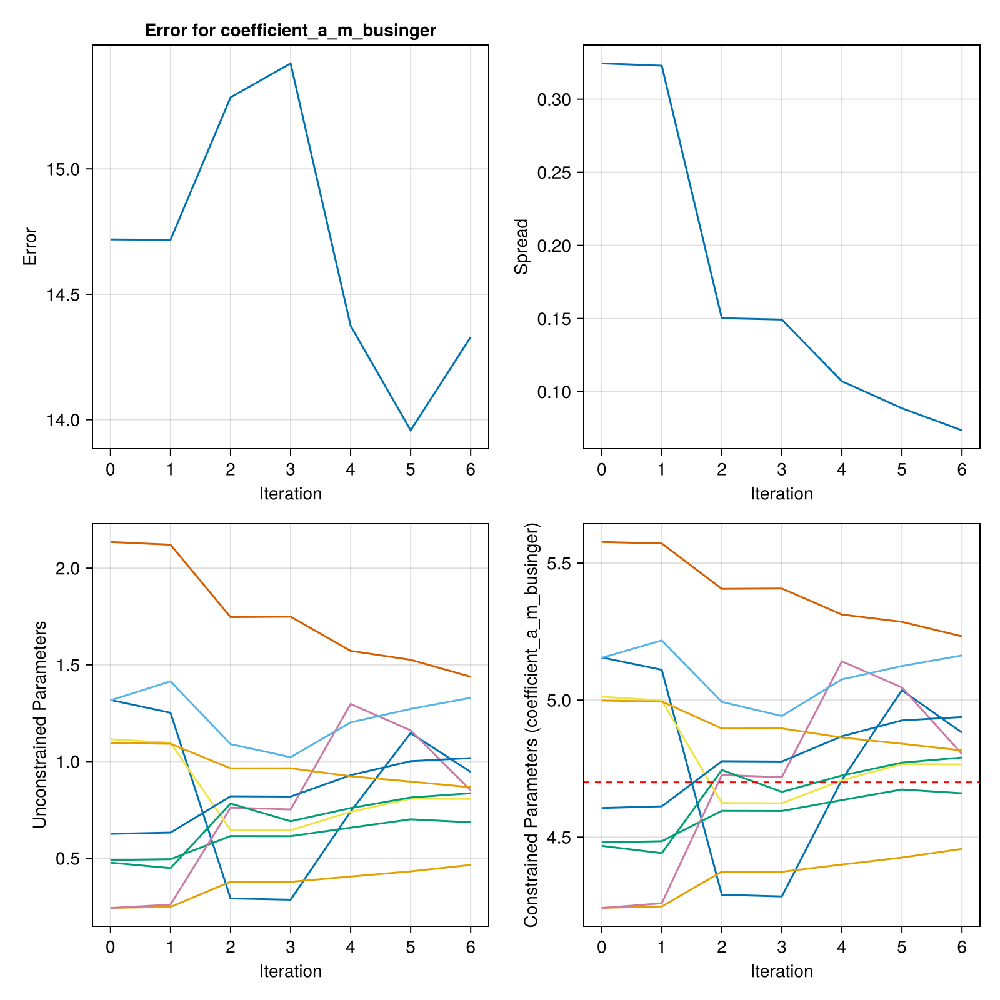
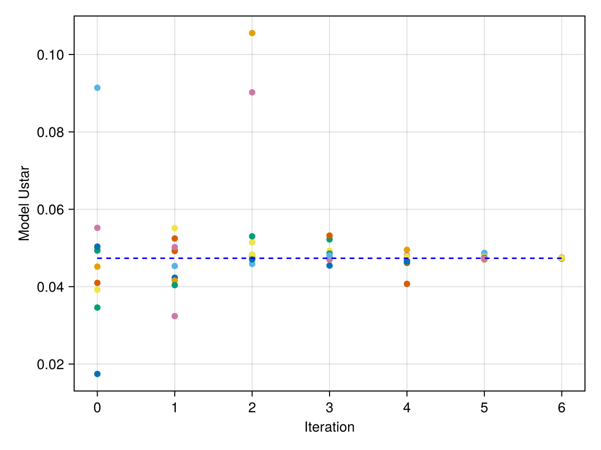

# Getting Started

!!! note "Preliminaries"
    You may find it helpful to read the [documentation](https://clima.github.io/EnsembleKalmanProcesses.jl/stable/)
    of EnsembleKalmanProcesses.jl before reading this section.

Every calibration requires
- observational data, which can be a Vector or an
  [`EnsembleKalmanProcess.Observation`](https://clima.github.io/EnsembleKalmanProcesses.jl/dev/API/Observations/#EnsembleKalmanProcesses.Observation)
- a prior parameter distribution. The easiest way to construct a distribution is
  with the [`EnsembleKalmanProcess.constrained_gaussian`](https://clima.github.io/EnsembleKalmanProcesses.jl/dev/API/ParameterDistributions/#EnsembleKalmanProcesses.ParameterDistributions.constrained_gaussian)
  function,
- a forward model, which uses input parameters to return diagnostic output
- an observation map, which maps the forward model's diagnostic output to a
  vector comparable to the observations

## Implementing your experiment

All [`calibrate`](@ref) functions require a backend, an
`EnsembleKalmanProcesses.EnsembleKalmanProcess` object, and a model interface.
This tutorial will not go into details on how to construct the
`EnsembleKalmanProcess` object. Please refer to the
[docs](https://clima.github.io/EnsembleKalmanProcesses.jl/stable/) instead.

### Backend system

!!! note "Backends"
    For more information about the backend system, see [Backends](@ref Backends).

There are three different kind of backends which are [`JuliaBackend`](@ref),
[`WorkerBackend`](@ref), and the HPC cluster backends.

The [`JuliaBackend`](@ref) is the simplest backend. The work done by each
ensemble member is done sequentially.

```@example backend
import ClimaCalibrate

backend = ClimaCalibrate.JuliaBackend()
nothing # hide
```

Next, the [`WorkerBackend`](@ref) is a backend compatible with Distributed.jl.
The work done by each ensemble member is done in parallel on different
processes. This backend is compatible with the Slurm and PBS job schedulers. It
requires starting a job with the resources necessary to start the worker
processes. In the example below, worker processes are being launched by
`addprocs` on a HPC cluster that supports Slurm. You would pass `backend` to
the [`calibrate`](@ref) function.

```julia
import ClimaCalibrate
import Distributed

Distributed.addprocs(ClimaCalibrate.SlurmManager())
backend = ClimaCalibrate.WorkerBackend()
```

Finally, the [`HPCBackend`](@ref) is a backend specific to each HPC cluster. The
work done by each ensemble member is done in parallel on different jobs. In the
example, each job would start with the `directives`, `modules`, and `env_vars`
listed. The job would last for 720 minutes with single task of 12 CPUs and 1
GPU with regular job priority. The `climacommon` module will be loaded when the
job starts and the environment variables for ClimaComms will be set.

```@example backend
import ClimaCalibrate

backend = ClimaCalibrate.DerechoBackend(;
    directives = [
        :job_priority => "regular",
        :time => 720,
        :ntasks => 1,
        :cpus_per_task => 12,
        :gpus_per_task => 1,
    ],
    modules = ["climacommon"],
    env_vars = ["CLIMACOMMS_CONTEXT" => "SINGLETON", "CLIMACOMMS_DEVICE" => "CUDA"],
)
nothing # hide
```

### Model interface

ClimaCalibrate provides the abstract type [`AbstractModelInterface`](@ref). For
calibration, you will create a struct that will subtype this type and implements
the required interface for this function to work.

The necessary functions are
- `forward_model(interface, iteration, member)` which runs the forward model for
  a single ensemble member.
- `observation_map(interface, iteration)` which processes model output and
  returns a matrix of outputs where each column is the forward model output.
  This matrix is called the `G_ensemble` matrix.

If you want to calibrate using one of the `HPCBackend`s, you also need to
implement
- `model_interface_filepath(interface)` which returns the path to the file that
  defines the model interface.

#### Forward Model

Your forward model must implement the
[`forward_model(interface, iteration, member)`](@ref) function stub.

Since this function only takes in the iteration and member numbers, there are
some hooks to obtain parameters and the output directory:

- [`path_to_ensemble_member(output_dir, iteration, member)`](@ref
  ClimaCalibrate.path_to_ensemble_member) returns the ensemble member's output
  directory, which is where the forward model should write.
- [`parameter_path(output_dir, iteration, member)`](@ref
  ClimaCalibrate.parameter_path) returns the ensemble member's parameter file,
  which can be read with TOML or passed to ClimaParams.

Put `output_dir` and anything else the model needs in the fields of your
`AbstractModelInterface` subtype. That object is what gets sent to a worker or
serialized into a job script, so anything not in it will not be there when the
forward model runs.

#### Observation map

!!! note "Observational data"
    Observational data generally consists of a vector of observations with
    length `d` and the covariance matrix of the observational noise with size
    `d × d`.

    If you need to stack or sample from observations,
    EnsembleKalmanProcesses.jl's
    [Observation](https://clima.github.io/EnsembleKalmanProcesses.jl/dev/API/Observations/#Observation) or
    [ObservationSeries](https://clima.github.io/EnsembleKalmanProcesses.jl/dev/API/Observations/#ObservationSeries) are fully-featured.

    For preprocessing observational data, you want to preprocess for `NaN`s
    and regrid and convert units to match the simulation data and vice versa.

    If you are using `ClimaAnalysis` to preprocess the observational data, then
    you may want to use [`ObservationRecipe`](@ref) to create
    observations from `OutputVar`s.

An **observation map** to process model output and return the full ensemble's
observations is also required.

This is provided by implementing the function stub
[`observation_map(interface, iteration)`](@ref). This function needs to return
a `Matrix` where the `i`th column is the `i`th ensemble member's observational
output. This matrix is called the G ensemble matrix.

Here is a simple template for the `observation_map`:

```julia
function ClimaCalibrate.observation_map(interface, iteration)
    # This assumes the output_dir is a field of interface
    (; output_dir) = interface
    ekp = ClimaCalibrate.load_ekp_struct(output_dir, iteration)
    ensemble_size = EKP.get_N_ens(ekp)
    G_ensemble = ClimaCalibrate.g_ens_matrix(ekp)
    for member in 1:ensemble_size
        G_ensemble[:, member] = process_member_data(iteration, member)
    end
    return G_ensemble
end
```

Note that each column of the G ensemble matrix should match with the
observations. A common source of error is that the ordering of the variables in
the observations is not the same as the ordering of the variables for the
columns of the G ensemble matrix.

!!! note "GEnsembleBuilder"
    If you are using `ObservationRecipe` to construct your observations and are
    using ClimaAnalysis to postprocess your simulation output, then you might
    want to use [`GEnsembleBuilder`](@ref) which simplifies the construction of the
    G ensemble matrix.

#### Optional postprocessing

If the interface and the iteration are not enough to determine the G ensemble
matrix, implement `postprocess_g_ensemble` as shown below. It gives you the
`ekp` object, the prior, and the output directory, so you can process the matrix
further using information that `observation_map` does not have access to.

```julia
function ClimaCalibrate.postprocess_g_ensemble(
    interface,
    ekp,
    g_ensemble,
    prior,
    output_dir,
    iteration
)
    return g_ensemble
end
```

After each evaluation of the observation map and before updating the ensemble,
it may be helpful to print the errors from the `ekp` object or plot
`G_ensemble`. This can be done by implementing the `analyze_iteration` as shown
below.

```julia
function ClimaCalibrate.analyze_iteration(
    interface,
    ekp,
    g_ensemble,
    prior,
    output_dir,
    iteration,
)
    @info "Analyzing iteration"
    @info "Iteration $iteration"
    @info "Current mean parameter: $(EnsembleKalmanProcesses.get_ϕ_mean_final(prior, ekp))"
    @info "g_ensemble: $g_ensemble"
    @info "output_dir: $output_dir"
    return nothing
end
```

### Parameters

Every parameter that is being calibrated requires a prior distribution to sample from.

EnsembleKalmanProcesses.jl's
[constrained_gaussian](https://clima.github.io/EnsembleKalmanProcesses.jl/dev/API/ParameterDistributions/#EnsembleKalmanProcesses.ParameterDistributions.constrained_gaussian)
provides a user-friendly way to construct Gaussian distributions.

Multiple distributions can be combined using
`combine_distributions(vec_of_distributions)`.

For more information, see the EKP documentation for
[prior distributions](https://clima.github.io/EnsembleKalmanProcesses.jl/dev/parameter_distributions/).

### Experiment Configuration

A calibration consists of `m` ensemble members that run for `n` iterations. The
recommended ensemble size is a function of the chosen method and
the number of parameters being calibrated. See the
[EnsembleKalmanProcesses.jl documentation](https://clima.github.io/EnsembleKalmanProcesses.jl/dev/defaults/#ens-size)
for more information for choosing the appropriate ensemble size.

### Calibrate

Now all of the pieces should be in place:
- forward map
- observation map
- observations
- covariance matrix of the observations (noise)
- prior distribution
- ensemble size
- number of iterations

Lastly, you need to set the output directory and the number of
iterations to run for.

```julia
n_iterations = 7
output_dir = "output/my_experiment"
```
Once all of this has been set up, you can put it all together using the
[`calibrate`](@ref) function:

```julia
# Construct the EnsembleKalmanProcess object as ekp
ClimaCalibrate.calibrate(
    backend,
    ekp,
    interface,
    n_iterations,
    prior,
    output_dir,
)
```

For more information on parallelizing your calibration, see the
[Backends](@ref Backends) page.

### File structure

For a calibration that ran for a single iteration, the calibration output directory
might look like this.

```
.
├── iteration_001
│   ├── eki_file.jld2
│   ├── G_ensemble.jld2
│   ├── member_001
│   │   ├── checkpoint.txt
│   │   └── parameters.toml
│   ├── member_002
│   │   ├── checkpoint.txt
│   │   └── parameters.toml
│   ├── member_003
│   │   ├── checkpoint.txt
│   │   └── parameters.toml
│   └── prior.jld2
└── iteration_002
    ├── eki_file.jld2
    ├── member_001
    │   └── parameters.toml
    ├── member_002
    │   └── parameters.toml
    └── member_003
        └── parameters.toml
```

Each file in the output directory serves a specific purpose:

- `eki_file.jld2`: The serialized `EnsembleKalmanProcess` state saved **before**
  the iteration runs. For example, `iteration_001/eki_file.jld2` holds the state
  used to generate the parameters for iteration 1.
- `parameters.toml`: Each member's sampled parameter values, written before the
  forward model runs. Load this via TOML or pass it to ClimaParams in your
  `forward_model`.
- `G_ensemble.jld2`: The G ensemble matrix produced by the observation map
  **after** all forward models in the iteration complete.
- `checkpoint.txt`: Records whether a member's forward model has `started` or
  `completed`. On a restart, completed members are skipped and the rest are
  rerun.
- `prior.jld2`: The prior distribution, saved once in `iteration_001`.

The JLD2 files can be loaded using
[`JLD2`](https://juliaio.github.io/JLD2.jl/stable/).

To access these paths programmatically:
- [`ekp_path(output_dir, iteration)`](@ref): Path to `eki_file.jld2` for the
  given iteration.
- [`parameter_path(output_dir, iteration, member)`](@ref): Path to an ensemble
  member's `parameters.toml`.
- [`path_to_ensemble_member(output_dir, iteration, member)`](@ref): Path to an
  ensemble member's output directory.
- [`path_to_iteration(output_dir, iteration)`](@ref): Path to an iteration's
  directory.

## Checkpointing

ClimaCalibrate checkpoints each forward model and iteration so that an
interrupted calibration can seamlessly pick up where it left off without wasting
resources.

If a calibration (run via `calibrate`) exits after completing an iteration, when
it is restarted it will automatically run the next iteration. This is done by
checking if the ensemble forward map results file (`G_ensemble.jld2`) and the
EKI file (`eki_file.jld2`) have been saved.

If a calibration is interrupted during forward model execution, causing a
partial iteration, incomplete forward models will be rerun when the calibration
is restarted. Completed forward models will not be rerun. This is done by
checking each model's checkpoint file and the flag it contains.

!!! note "Forward model restarts"
    Although the model is checkpointed, this does not mean the forward model
    will automatically restart. This functionality is delegated to the forward
    model.

## Example Calibrations

The [Calibration Tutorial](literate_example.md) is a complete example that runs
locally, and shows the changes needed to run the ensemble on
[`WorkerBackend`](@ref) workers.

Another example experiment lives in the package repo under
`experiments/surface_fluxes_perfect_model`. It uses the
[SurfaceFluxes.jl](https://github.com/CliMA/SurfaceFluxes.jl) package to compute
the Monin-Obukhov turbulent surface fluxes for a set of idealized profiles, and
calibrates one Businger coefficient, `coefficient_a_m_businger`, against the
profile-averaged friction velocity.

The observation comes from the same model run with its default parameters, which
is what makes it a perfect-model calibration. It carries a 2% error. The model
carries another 2%, standing in for the internal variability that makes a
climate model return a different statistic on every run, and the calibration is
given the two together as its noise covariance. The prior is centered at 3.5,
while the observation was generated with 4.7, so the ensemble starts somewhere
it has to travel from.

One observable constrains one parameter. `coefficient_a_h_businger` moves the
friction velocity in almost the same direction as `coefficient_a_m_businger`, so
a single number cannot tell the two apart, and calibrating both would leave the
ensemble free to slide along that ridge. Separating them takes a second
observable that responds to the heat flux.

It calibrates with
[unscented Kalman inversion](https://clima.github.io/EnsembleKalmanProcesses.jl/dev/unscented_kalman_inversion/),
which places its members on a quadrature stencil around the current mean rather
than drawing them at random. One parameter therefore needs three members, and
the whole calibration costs three forward model runs per iteration. The
error falls from 20 to below 1 and the mean parameter climbs from 3.5 to within
0.2 of the 4.7 the observation was generated with, which is as close as the
noise allows. The scheduler stops the run once the misfit reaches the size of
the noise, usually a few iterations short of the ten requested. An unscented
ensemble does not collapse: the stencil narrows onto the posterior covariance
and holds there, still spanning 4.7, which is the statement of how well one
noisy observation pins the parameter down.

This example runs on the most common backend, the [`JuliaBackend`](@ref), with
the following script:

```julia
import ClimaCalibrate
import EnsembleKalmanProcesses as EKP

include(joinpath(pkgdir(ClimaCalibrate), "experiments", "surface_fluxes_perfect_model", "utils.jl"))
@show ensemble_size n_iterations observation variance prior

# Unscented Kalman inversion places its members on a quadrature stencil, so it
# builds its own ensemble from the prior
ekp = EKP.EnsembleKalmanProcess(observation, variance, EKP.Unscented(prior))

output_dir = "my_experiment"
mkpath(output_dir)
eki = ClimaCalibrate.calibrate(
    JuliaBackend(),
    ekp,
    SurfaceFluxModelInterface(output_dir, ensemble_size),
    n_iterations,
    prior,
    output_dir,
)

theta_star_vec = (; coefficient_a_m_businger = 4.7)

convergence_plot(
    eki,
    prior,
    theta_star_vec,
    ["coefficient_a_m_businger"],
    output_dir,
)

g_vs_iter_plot(eki, output_dir)

loss_landscape_plot(
    observation,
    variance,
    output_dir;
    calibrated = only(EKP.get_ϕ_mean_final(prior, eki)),
)
```

`convergence_plot` shows the error, the spread, and the three members of the
stencil in unconstrained and constrained space. The dashed line marks the 4.7
the observation was generated with, which the stencil still spans at the end.
Both figures are generated when these docs are built, so they show what the
code on this page does:



`g_vs_iter_plot` shows what each member's forward model returns. The red line is
the observation the calibration fits, and the blue line is what the model
returns at the parameter the observation was generated with. The gap between
them is the error the observation carries:



`loss_landscape_plot` sweeps the parameter and plots the loss the calibration is
descending, the covariance-weighted misfit that `EKP.get_error` reports. The
grey curve is the loss a model without internal variability would present, and
the black curve is the one this calibration sees:


The model error turns a smooth bowl into a landscape whose local minima are
everywhere, and a method that followed the local slope would stop at whichever
one it started nearest. An ensemble Kalman method does not follow the slope. It
fits a linear map between the parameters and the model output over the whole
ensemble, so the model error, which is uncorrelated between members, averages
out of that fit, and the update follows the shape of the underlying bowl. What
it recovers is the minimum to within the noise: the ensemble settles about 0.2
from the generating value, which is the width the noise leaves in the parameter,
and reports a posterior spread of about that size rather than collapsing onto
one of the local minima. The error also stops falling monotonically, since each
iteration lands on a different draw of the model error.
